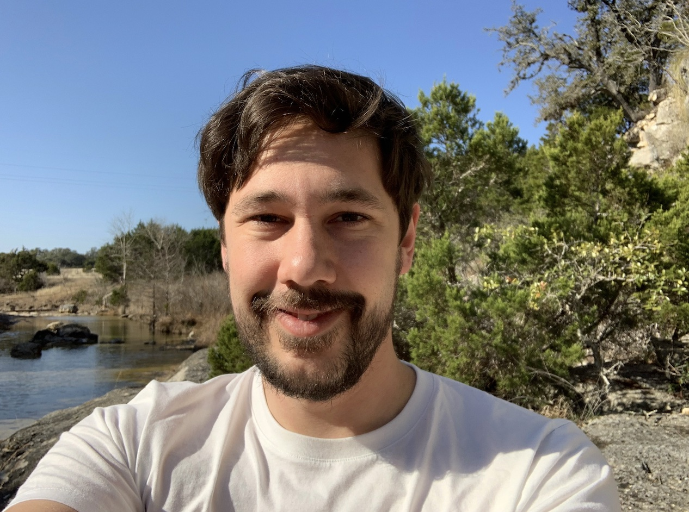

# Étienne Fortier-Dubois

Writer and programmer based in 📍 Montreal, Quebec

I am a generalist at heart. Over the years I've been involved in scientific research in evolutionary biology, cancer care data, writing fiction in French, and natural language software. I enjoy programming and would like to work in a tech company with fun people, but all things considered I enjoy writing (and editing) even more, and this is what I have been focusing on lately.

[Email](mailto:etiennefd@gmail.com) / [Personal website](https://www.etiennefd.com) / [Blog](https://etiennefd.substack.com) / [Twitter](https://twitter.com/etiennefd) / [LinkedIn](https://www.linkedin.com/in/%C3%A9tienne-fortier-dubois-93251111b/)	/ [GitHub](https://github.com/etiennefd/)

---

## 💼 Work Experience

### **Independent Projects** | _February 2021–present_

In early 2021, I quit my software job to try my hand at various independent projects.

* [The Journal of Accessible and Well-Written Science](https://jawws.com): JAWWS is a project to improve the quality of science writing that is aimed at other scientists. I have been researching ways to make a paper less cognitively demanding, as well as examining how the current norms in scientific publishing came about. Visit [the website I created](https://jawws.com) or [subscribe to the newsletter](https://jawws.substack.com/) to read my writing on these topics. This work has been supported by [New Science](https://newscience.org).
* [Creator Cabins](https://www.creatorcabins.com/): This is an organization devoted to creating physical spaces for online creators. In the fall of 2021, I spent one month at the cabin near Austin, Texas, as part of a residency to work on JAWWS. Since then I have also been an active member of the online Cabin community and I have been contributing some writing and editing work, and helped host an event at the Austin cabin.
* [Interintellect](https://interintellect.com/): Interintellect organizes intellectual discussion salons. I worked for five months to help set up the company's website (on Wordpress) and other behind-the-scene tasks. I am also an active host in the community, having organized more than ten salons, online and in person, since December 2020.
* [Blog — Atlas of Wonders and Monsters](https://etiennefd.substack.com/): I write a weekly blog post on any topic. In November 2020, I committed to publish every Wednesday for 100 weeks (until October 2022), and I have succeeded so far. Feel free to subscribe.
* [The Classical Futurist](https://classicalfuturist.com/): A monthly magazine to think about the future from the lens of classical antiquity that I co-founded with two friends.
* I finished and edited a novel about New France and Quebec historical cinema. It's currently in the hands of potential publishers.
* I have also been doing occasional freelance iOS programming work, mostly debugging an app for car dealership auditing.  

### **Software Developer** at [Druide informatique](https://druide.com) | _February 2019–February 2021_

* Druide is a Montreal-based tech company that makes the software *Antidote*, a grammar and spelling aid for French and English. 
* I worked specifically on a macOS application used within the company to manage and update lexicographic data. I worked closely with linguists and dealt with many concepts from natural languages from a computer science point of view.
* Main programming languages used: Swift, Objective-C, Python
* During this time I also taught myself iOS programming in Swift as a personal weather app project.

###  **Data Administrator** at [Rossy Cancer Network](https://www.linkedin.com/company/rossycancer/?originalSubdomain=ca) | _January 2017–January 2018_

* I managed and analyzed data from cancer patients with a goal of helping physicians improve the outcomes of cancer care in the McGill University hospital network. 
* Main tools: Microsoft Excel, Microsoft Access

### **Fun Small Jobs From My Deep Past**

* 💿 Helped with the online inventory of a classical music CD vendor (2013)
* 🗣 Was a camp counsellor for teenagers in French immersion for the summer in Quebec City (2012)
* 🛢 Worked with hazardous materials data at two Canadian military bases (2010-2011)
* 🔭 Showed visitors around and handled the telescope at a small astronomical observatory (2009)

## 🎓 Education

### **McGill University** | Bachelor of Science, Computer Science | *2017–2018*
* In 2017, I went back to school to get a full degree in computer science
* Spent the summer of 2018 on a research internship. I used machine learning and natural language processing to mine data from the medical literature on frailty.

### **Uppsala University and University of Montpellier** | Master of Science, Evolutionary Biology | *2014–2016*
* A European master's program intended to gain research experience at various universities. I spent two non-consecutive semesters at Uppsala, Sweden; one at Montpellier, France; and one at Harvard, Massachusetts. 
* In France, I worked on theoretical modelling of biological innovation.
* In Sweden, I worked on paleontological data from Siberia.
* At Harvard, I worked on phylogenetic trees in the context of cultural evolution in human societies. 

### **McGill University** | Bachelor of Science, Honours Biology | _2010–2013_
* Minor in computer science
* Undergraduate thesis on toads and sexual dimorphism
* Highlight: a field course to learn about dinosaur paleontology in Saskatchewan
* Spent the summer of 2013 on a research internship to model food chains; I coded a simulation in Java

## 📚 On the Side & Other Skills

### Languages 
* French: native
* English: fluent
* Rudimentary knowledge of Spanish and Swedish
* I like to learn new writing systems (Greek, Japanese, Korean, Cyrillic)

### Computer skills
- Apple frameworks (Swift, Objective-C, UIKit; I've done some of both macOS and iOS programming)
- Python
- Wordpress setup and customization
- Jekyll static websites
- Git, GitHub, GitLab
- Databases, SQL
- I know the basics of blockchains and crypto

### Fiction
* I have written four complete novels, none of which have been published (but I'm hoping the latest one will be)
* I have published three short stories in various literary magazines, [one of which](https://www.erudit.org/fr/revues/moebius/2016-n151-moebius03037/85430ac/) was adapted into [a short film](https://www.kinomontreal.com/films/everything-must-go-mon-amour/)

### Skills I've gotten rusty at but could pick up again if I needed to
* Typesetting: LaTeX
* Programming languages: Java, C, C++
* Data science: R, some Python libraries, basic machine learning

---

As of early 2022 I look like this: 

